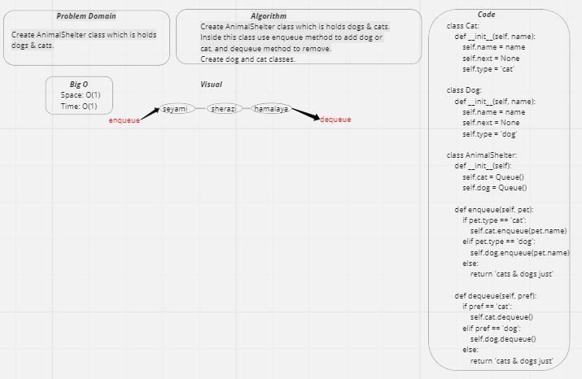

# FIFO Animal Shelter

### Challenge:
- Challenge asked me to create a class called AnimalShelter that holds just cats and dogs.
- The methods that I have implemented them are:
- - enqueue to add animal to the shelter.
- - dequeue to return dog or cat.

### Whiteboard:

### Approach & Efficiency:
- Space: O(1)
- Time: O(1)