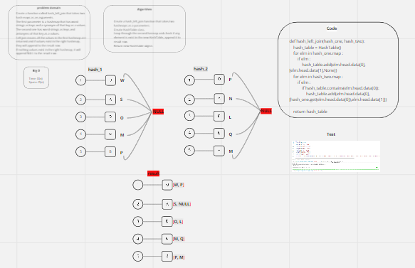

# hashmap join left

#### Challenge:
- Create a hash_left_join function and takes two hash maps as arguments.
- The returned data structure that holds the results like that:
- -  Combine the key and corresponding values (if they exist) into a new data structure according to LEFT JOIN logic.
- - LEFT JOIN means all the values in the first hashmap are returned, and if values exist in the “right” hashmap, they are appended to the result row.
- - If no values exist in the right hashmap, then some flavor of NULL should be appended to the result row.

#### Whiteboard:

#### Approach & Efficiency:
- Big O:
- - Time and Space O(n)