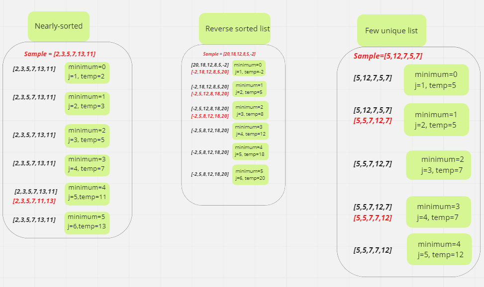

# Tracing:
### given list = [15,4,9,7]

- pass 1:
- - minimum = 0
- - j = 1
- - temp = 4
 - - In the first pass, we check if there is a smaller number in the list than what is currently present in index 0. 

 - pass 2:
 - - minimum = 1
 - - j = 2
 - - temp = 6
 - - In the second pass, we check if there is a smaller number in the list than what is currently present in index 1.

 - pass 3:
 - - minimum = 2
 - - j = 3
 - - temp = 7
 - - In the third pass, we check if there is a smaller number in the list than what is currently present in index 2.

 - pass 4:
 - - minimum = 3
 - - j = 4
 - - temp = 9
 - - In the forth pass, we check if there is a smaller number in the list than what is currently present in index 3.

- pass 5:
- - minimum = 4
- - j = 5
- - temp = 15
- - the last pass ,the last index swap itself [4,6,7,9,15]>>[4,6,7,9,15]

### Visualize:
