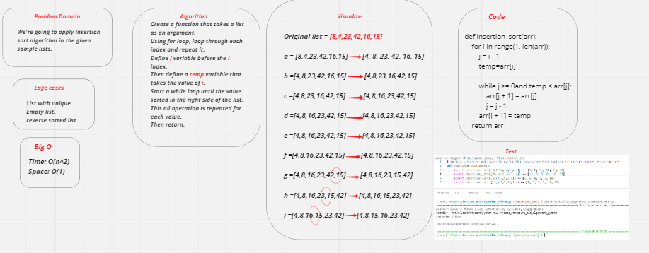

# Insertion sort list
- Insertion sort is a sorting algorithms that traverses the array multiple times as it slowly builds out the sorting sequence. Traversal keeping track of the minimum value and places it in the front of the array which should be sorted incrementally.

### Whiteboard:

### Challenge:
- Visualize the setup through the sample of lists provided.
- Dealing with pseudo code to convert it to real code.

### Approach & Efficiency:
- Time:O(n^2):
- - The operatoin of this algorithm is comparing.
- Space: O(1):
- - This list is sorted un a place, that keep the space constant.