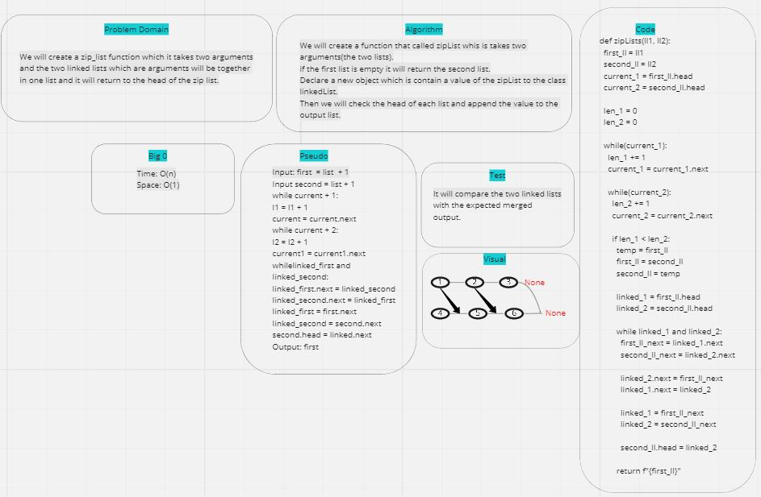

# zip_List:
- Challenge asked me to take two lists as an arguments and merged them.

## Challenge:
- Challenge was how to deal with inside two lists and merged them together.

## Whiteboard:

## Approach & Efficiency:
- Speed: O(1).
- Time: O(n).
