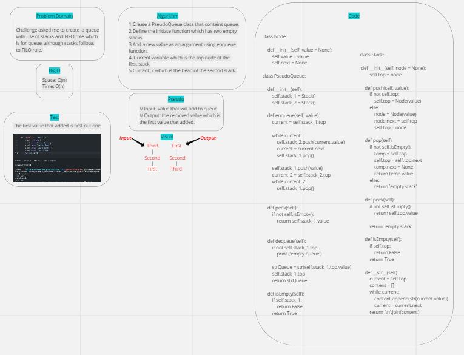

# queue with stacks

## Challenge:
- The main challenge is to how to deal with queue which has FIFO rule & stacks which has FILO rule.

## Whiteboard:

## Approach & Efficiency:
- Space: O(n)
- Time: O(n)

## Solution:
- Input: "first" "-------->" "second" "-------->" "third" "------->" "fourth".
- Output: "fourth" "---------->" "third" "---------->" "second" "---------->" "first".