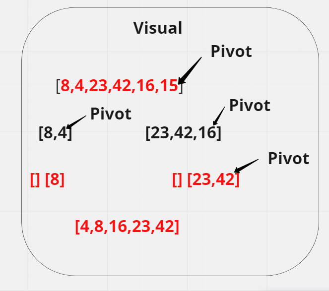

# Tracing

### Algorithm:
1. consider the pivot as a last element, then divide the list.
2. In partition, the list is broken into 2 sub lists and all of the elements are smaller than the pivot will be on the left side of the pivot and the bigger elements will be on the right.
3. The pivot will be on the last position.
4. sub elements on the right and left side don't require to be sorted.
5. Then we recursively pick the left and right sub-lists, and we perform partitioning on each of them by choosing a pivot in the sub-lists and the steps are repeated for the same.

### List = [8,4,23,42,16,15]

- a) 
- - pivot = 15
- - first sub list contains the numbers that less than the pivot which is 15.
- - second one contains the numbers that bigger than 15.

- b)
- - pivot = 4.
- - 4 will swap with 8.
- - the output will be like [4,8,15,23,42,16]

- c)
- - pivot = 16
- - first sub list list contains the numbers that les than 16.
- - second one contains th numbers that bigger than 16.

- the list will sort like this at end [4,8,15,16,23,42]

