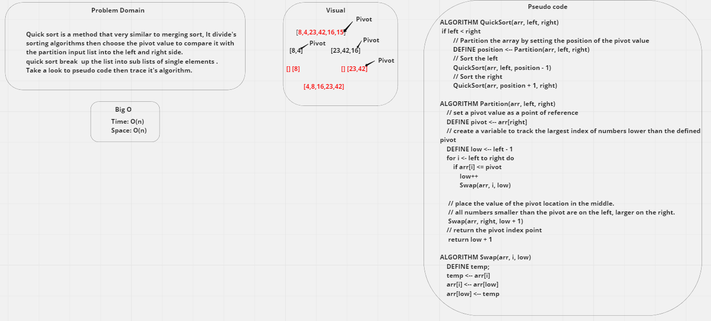

# quick sort
- Quick sort is a method that very similar to merging sort, It divide's 
sorting algorithms then choose the pivot value to compare it with the partition input list into the left and right side.
quick sort break  up the list into sub lists of single elements.
Take a look to pseudo code then trace it's algorithm.

### Whiteboard:

### Approach & Efficiency:
- speed : bigO(n^2)
- space : bigO(n)