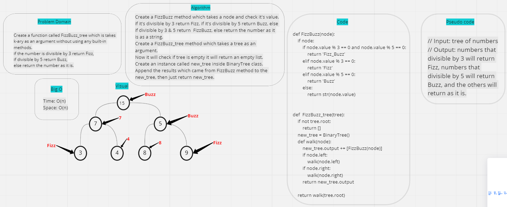

# FizzBuzz on k-ary

### Challenge:
- Create a function called FizzBuzz_tree which takes k-ary tree as an argument without using any built-in methods.

### Whiteboard:

### Approach & Efficiency:
-Big O:
- - Time: O(n)
- - Space: O(n)