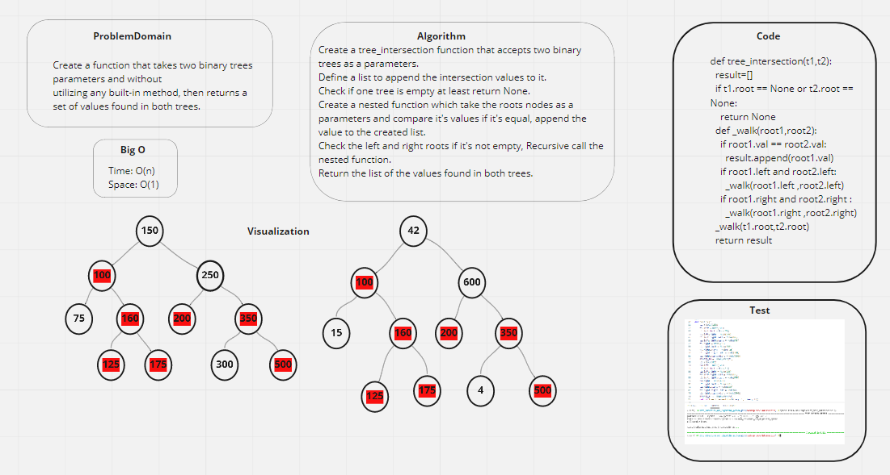

# tree_intersection

### Challenge:
- Create a tree_intersection function that takes two binary tree as a parameters.
- Without using of any built-in methods, and return a values which are found in both trees.

### Whiteboard:

### Approach & Efficiency:
- Big O:
- - Time: O(n)
- - Space: O(1)