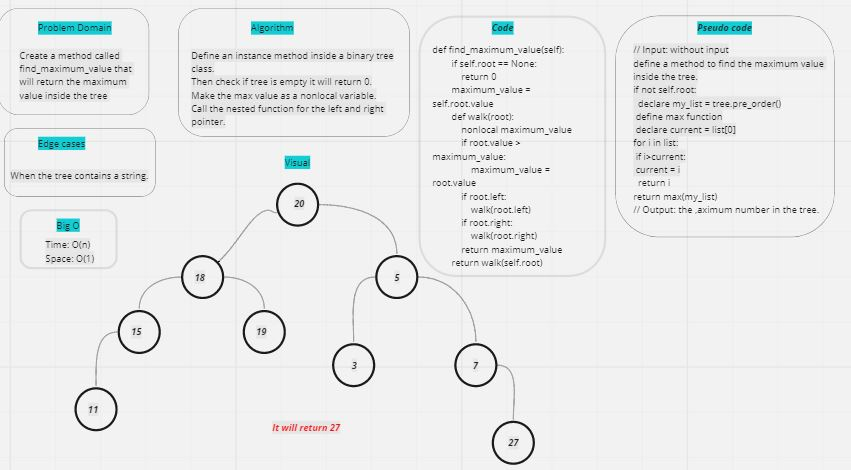

# find a maximum value:
- Find a maximum value inside the tree.

### Challenge:
- Write an instance method called find-maximum-value. Without utilizing any of the built-in methods available.

### Whiteboard:

### Approach & Efficiency:
- Big O :
- Time O(n)
- Space O(1)