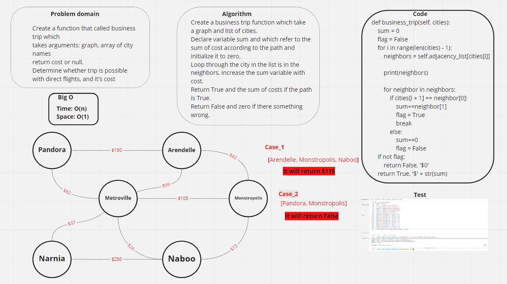
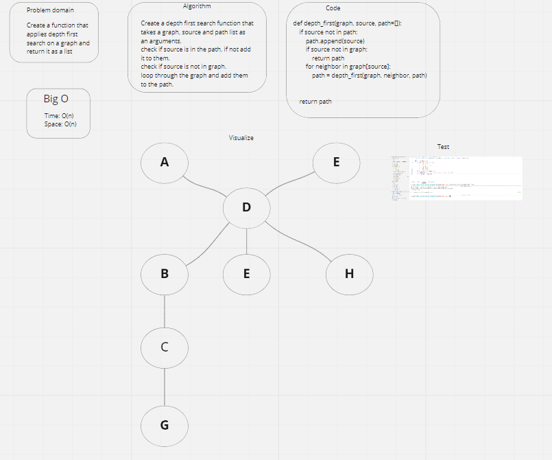

# Graphs
- Graph is a non-linear data structure that consist of nodes and edges. The nodes are sometimes also referred to as vertices and the edges are lines or arcs that connect any two nodes in the graph.

### Challenge:
- The challenge was to create ad adjacency list, which the most common way to represent graphs, and it's a collection of linked lists or array that lists all of the other verticies that are connected.

### Aproach & efficiency:
- Big O:
- - Time: O(1)
- - Space: O(1)

### API:
- - add nodes.
- - add an edges.
- - get the nodes.
- - get the neighbors of an input node.
- - get the graph size.

-----------------------------------------------------------------------
# Breadth first search

### Challenge:
- Write the following method for the Graph class: - breadth first - Arguments: Node - Return: A collection of nodes in the order they were visited. - Display the collection

### Whiteboard:

### Approach & Efficiency:
- Big O:
-- Time: O(V+E)
- - Space: O(n)

----------------------------------------------------------------------------
# Business trip

#### Challenge:
- Create a business trip function
- - Arguments: graph, array of city names
- - Return: cost or null

### Whiteboard:

### Approach & Efficiency:
- Big O :
- - Time : O(n)
- - Space : O(1)

-----------------------------------------------------------
# depth first search

### Challenge
- Implement depth first search on graph.

### Whiteboard:

### Approach & Efficiency
- Big O:
- - Time: O(n)
- - Space: O(n)