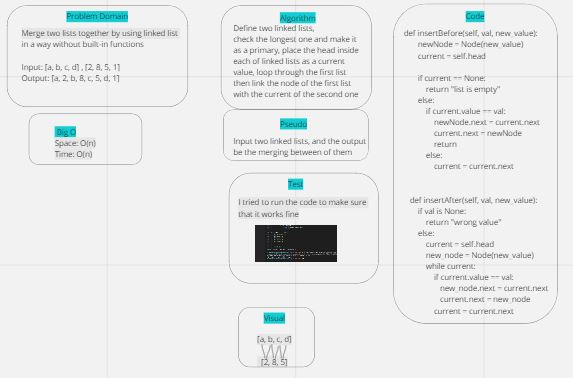
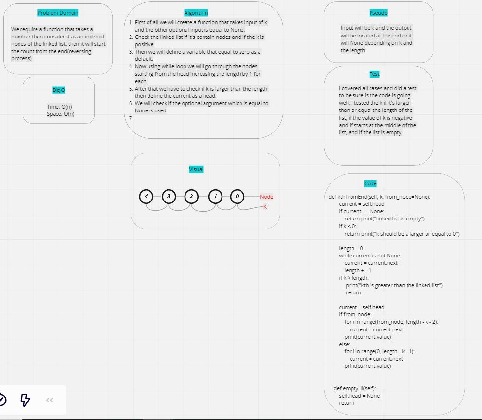

# Linked lists:
- A linked list is a linear data structure, in which the elements are not stored at contiguous memory locations.

## Challenge:
- - class Node has a properties for the value that stored in the Node and the pointer to the next node.
- - I ncludes method takes any value as an argument then it returns a boolean as a result.
- - __str__ method doesn't take an argument then returns a string in the linked list as this: {1} -> {2} -> {3} -> {4} -> None

## Approach & Efficiency:
- Speed: O(n)
- Time: O(n)

## API:
- - Insert a Node in the front of the linked list.
- - Go through a specific Node.
- - Return a sequence of the content of the linked list.
----------------------------------------------------------------------
- Code challenge(6):
# ll-insertion:
- This challenge wanted to add a values at the end of the linked list, and the function which takes two arguments.

## Challenge:
- The challenge was with the merging between two functions to find and insert the values.

## Whiteboard:

## Approach & Efficiency:
- Space: O(n)
- Time: O(n)
----------------------------------------------------------------------------
- Code challenge(7):

# ll-kth from the end:
- The challenge just asked me to find the value of node k but starting from the end of the list.

## Challenge:
- The main challenge was how to find a method to get the last node and starting from the end, then start from the middle.

## Whiteboard:

## Approach & Efficiency:
- Time: O(n)
- Space: O(n)

